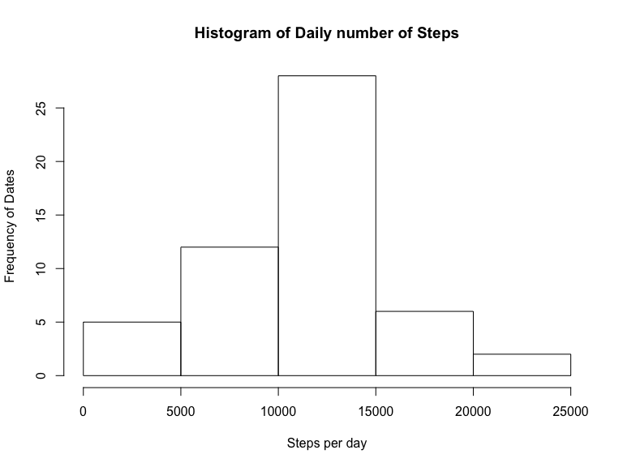
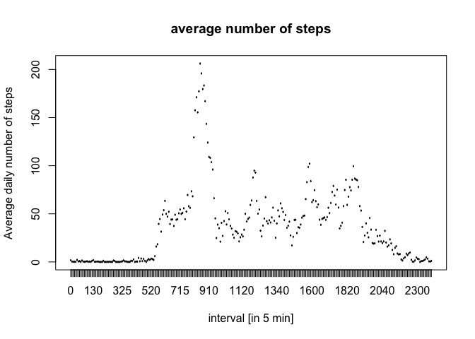
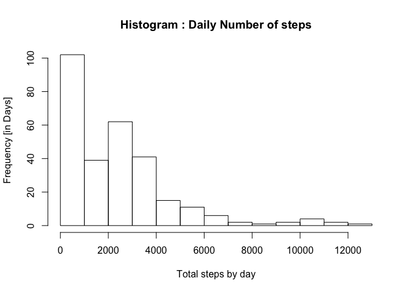
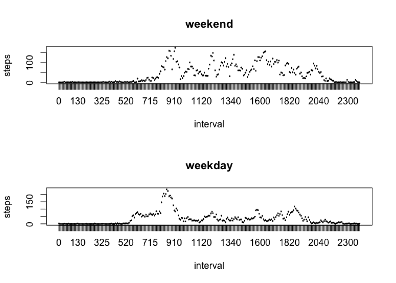

# Reproducible Research: Peer Assessment 1
Amlan Chatterjee  
September 10, 2015  

## Executive Summary
This document presents a report on daily activity data in terms of steps collected via an activity monitoring device for the month of October and November 2012. The code used for analyzing the data is included and also available at [my course github page](https://github.com/amlans-coursera-courses/RepData_PeerAssessment1 "Amlans RepData Github page")

## Loading and preprocessing the data
The dataset is stored in a comma-separated-value (CSV) file and there are a total of 17,568 observations. I am loading the data by unzipping the given zip file and loading the resultant CSV file as R dataframe. 


```r
if (!require("knitr")) {
    install.packages("knitr")
}
```

```
## Loading required package: knitr
```

```r
if (!require("scales")) {
    install.packages("scales")
}
```

```
## Loading required package: scales
```

```r
if (!require("ggplot2")) {
    install.packages("ggplot2")
}
```

```
## Loading required package: ggplot2
```

```r
library(knitr)
library(scales)
library(ggplot2)

if (!file.exists("activity.csv")) {
    if (file.exists("activity.zip")) {
        unzip("activity.zip")
    }
}

activity <- read.csv("activity.csv", 
                     header=TRUE, 
                     sep=",", 
                     colClasses=c("numeric", "character", "numeric"))

activity$interval <- factor(activity$interval)
activity$date <- as.Date(activity$date, format="%Y-%m-%d")
str(activity)
```

```
## 'data.frame':	17568 obs. of  3 variables:
##  $ steps   : num  NA NA NA NA NA NA NA NA NA NA ...
##  $ date    : Date, format: "2012-10-01" "2012-10-01" ...
##  $ interval: Factor w/ 288 levels "0","5","10","15",..: 1 2 3 4 5 6 7 8 9 10 ...
```

## What is mean total number of steps taken per day?

**1. A histogram of the total number of steps taken each day**

```r
steps.date <- aggregate(steps ~ date, activity, sum)
hist(steps.date$steps, names.arg=steps.date$date, xlab="Steps per day", ylab="Frequency of Dates", main="Histogram of Daily number of Steps")
```

 

**2. Mean and Median total number of steps taken per day**


```r
mean1 <- mean(steps.date$steps, na.rm = TRUE)
median1 <- median(steps.date$steps, na.rm = TRUE)
```

## What is the average daily activity pattern?

**1. Make a time series plot (i.e. type = "l") of the 5-minute interval (x-axis) and the average number of steps taken, averaged across all days (y-axis)**

*Here we aggregate the total number of steps per interval (i.e. 5, 10, 15 etc…) and also calculate the mean for each interval. We then plot this mean value against time.*


```r
steps.interval <- aggregate(steps ~ interval, data=activity, FUN=mean)
plot(steps.interval, type="l",xlab="interval [in 5 min]", ylab="Average daily number of steps",  main="average number of steps")
```

 

**Which 5-minute interval, on average across all the days in the dataset, contains the maximum number of steps? **


```r
message("Interval with max steps: ", steps.interval$interval[which.max(steps.interval$steps)])
```

```
## Interval with max steps: 835
```

## Imputing missing values

**1. Calculate and report the total number of missing values in the dataset (i.e. the total number of rows with NAs)**


```r
message("Total number of missing values: ", sum(is.na(activity)), appendLF = TRUE)
```

```
## Total number of missing values: 2304
```

**Devise a strategy for filling in all of the missing values in the dataset. The strategy does not need to be sophisticated. For example, you could use the mean/median for that day, or the mean for that 5-minute interval, etc.**

I'll use the mean of steps. It's already stored as mean1

**Create a new dataset that is equal to the original dataset but with the missing data filled in.**

*Using previously stored variable mean1 to fill in NA*


```r
activity.merged <- merge(activity, steps.interval, by="interval")
activity.merged$steps.x[is.na(activity.merged$steps.x)] = activity.merged$steps.y[is.na(activity.merged$steps.x)]
```
**Make a histogram of the total number of steps taken each day and Calculate and report the mean and median total number of steps taken per day. Do these values differ from the estimates from the first part of the assignment? What is the impact of imputing missing data on the estimates of the total daily number of steps?**

*To draw a histogram we need to recalculate the interval summaries of steps*


```r
activity.merged <- aggregate(steps.x~interval,activity.merged,sum)
hist(activity.merged$steps.x, xlab="Total steps by day", ylab="Frequency [in Days]",main="Histogram : Daily Number of steps")
```

 


**Recalculate the mean and median**

```r
mean2 <- mean(activity.merged$steps, na.rm=TRUE)
message("Recanculated MEAN: ", mean2)
```

```
## Recanculated MEAN: 2280.33857442348
```

```r
median2 <- median(activity.merged$steps, na.rm=TRUE)
message("Recanculated MEDIAN: ", median2)
```

```
## Recanculated MEDIAN: 2080.90566037736
```

*The histogram now has  more acumulated values under 2000 steps a day. The values of mean and median also follow this pattern since they went from more than 10000 to less than 3000. Replacing the NA values for the steps by a very low value, completely altered the perspective of this data*

## Are there differences in activity patterns between weekdays and weekends?

**1. Create a new factor variable in the dataset with two levels – “weekday” and “weekend” indicating whether a given date is a weekday or weekend day.**


```r
daytype <- function(date) {
    if (weekdays(as.Date(date)) %in% c("Saturday", "Sunday")) {
        "weekend"
    } else {
        "weekday"
    }
}
activity$daytype <- as.factor(sapply(activity$date, daytype))
str(activity)
```

```
## 'data.frame':	17568 obs. of  4 variables:
##  $ steps   : num  NA NA NA NA NA NA NA NA NA NA ...
##  $ date    : Date, format: "2012-10-01" "2012-10-01" ...
##  $ interval: Factor w/ 288 levels "0","5","10","15",..: 1 2 3 4 5 6 7 8 9 10 ...
##  $ daytype : Factor w/ 2 levels "weekday","weekend": 1 1 1 1 1 1 1 1 1 1 ...
```
**2. Make a panel plot containing a time series plot (i.e. type = “l”) of the 5-minute interval (x-axis) and the average number of steps taken, averaged across all weekday days or weekend days (y-axis). See the README file in the GitHub repository to see an example of what this plot should look like using simulated data.**


```r
par(mfrow = c(2, 1))
for (type in c("weekend", "weekday")) {
    steps.type <- aggregate(steps ~ interval, data = activity, subset = activity$daytype == 
        type, FUN = mean)
    plot(steps.type, type = "l", main = type)
}
```

 
